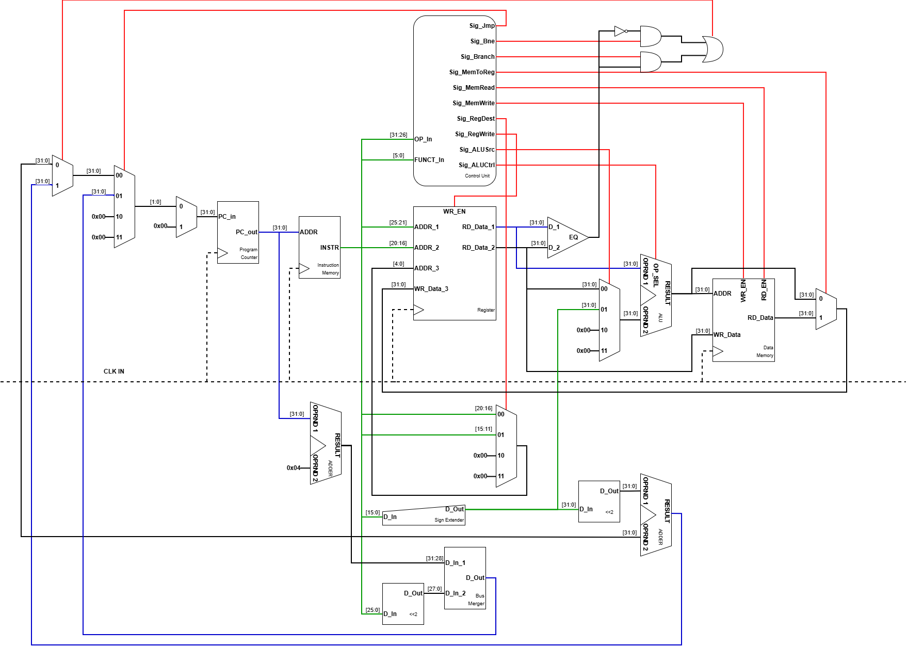
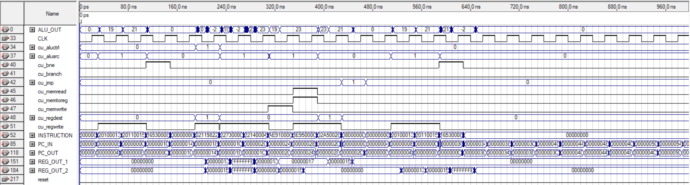

# Synthesizable MIPS32 Microprocessor

A synthesizable **32-bit, single-cycle-style MIPS32 subset processor** written in VHDL. The design integrates instruction fetch, decode, register access, arithmetic/logic execution, branching, data-memory access, and write-back in a modular datapath.

## Architecture

The processor implements a synthesizable single-cycle MIPS32-style datapath

The Program Counter fetches instructions from Instruction Memory, while the Control Unit decodes the opcode and generates control signals for register write-back, ALU operation, memory access, branching, and jumping. The Register File supplies operands to the ALU, whose result is used for arithmetic operations or as a data-memory address.

For `lw`, memory data is written back to the register file; for `sw`, register data is written to memory. Branch logic selects the branch target for `beq` and `bne`, while the jump path generates the target address for `j`. The PC multiplexer then selects the next instruction address.

<p align="center">
  
</p>

Key RTL modules:

| File | Purpose |
|---|---|
| `src/top_level.vhd` | Integrates the complete processor datapath and control signals |
| `src/cu.vhd` | Main instruction decoder and control-unit logic |
| `src/alu.vhd` | 32-bit add/sub ALU |
| `src/cla_32.vhd` | 32-bit carry-lookahead adder used by the ALU and PC arithmetic |
| `src/reg_file.vhd` | 32 × 32-bit register file; `$zero` remains hardwired to zero |
| `src/program_counter.vhd` | Clocked program-counter register |
| `src/instruction_memory.vhd` | ROM wrapper initialized by `imemory.mif` |
| `src/data_memory.vhd` | Single-port RAM wrapper initialized by `dmemory.mif` |
| `src/tb_top_level.vhd` | Functional testbench with clock and reset generation |

## Supported Instruction Subset

| Category | Instructions | Implemented behavior |
|---|---|---|
| R-type arithmetic | `add`, `sub` | Register-to-register addition and subtraction |
| I-type arithmetic | `addi` | Register plus sign-extended immediate |
| Conditional control flow | `beq`, `bne` | Equality and inequality branch decisions via a 32-bit comparator |
| Memory access | `lw`, `sw` | Base-plus-offset load and store |
| Unconditional control flow | `j` | Absolute jump target formed from `PC + 4` and the 26-bit instruction field |
| No operation | `nop` | Encoded as `sll $zero, $zero, 0` (`0x00000000`) |

## Verification Program

The instruction program in `src/imemory.mif` exercises the supported datapath paths listed below.

| Address | Machine code | Assembly interpretation | Verification purpose | Expected effect |
|---:|---:|---|---|---|
| `0x00` | `20100013` | `addi $s0, $zero, 19` | Immediate arithmetic | `$s0 = 19` |
| `0x04` | `20110015` | `addi $s1, $zero, 21` | Immediate arithmetic | `$s1 = 21` |
| `0x08` | `16530008` | `bne $s2, $s3, +8` | Branch decode and comparator path | Not taken because both registers initialize to `0`; sequential execution continues |
| `0x0C` | `00000000` | `nop` | No-operation encoding | No architectural state change |
| `0x10` | `02119822` | `sub $s3, $s0, $s1` | R-type subtraction | `$s3 = 19 - 21 = -2` (`0xFFFFFFFE`) |
| `0x14` | `22730000` | `addi $s3, $s3, 0` | I-type add path using a non-zero source register | `$s3` remains `-2` |
| `0x18` | `22140004` | `addi $s4, $s0, 4` | Effective-address generation | `$s4 = 23` (`0x00000017`) |
| `0x1C` | `AE910000` | `sw $s1, 0($s4)` | Store path | Stores `21` at the address held by `$s4` |
| `0x20` | `8E950000` | `lw $s5, 0($s4)` | Load and write-back path | `$s5 = 21` |
| `0x24` | `02A50020` | `add $zero, $s5, $a1` | R-type addition datapath | ALU evaluates the addition, but the destination is `$zero`, so no register state is modified |
| `0x28` | `08000000` | `j 0x00000000` | Jump target and PC redirection | Restarts the test program |
| `0x2C` | `00000000` | `nop` | Branch-target placeholder | Reached only when the `bne` condition is true |

### Coverage Notes

The current program **executes** `addi`, `sub`, `sw`, `lw`, `add`, `nop`, and `j`. It also decodes `bne`, but the initialized test state makes the branch **not taken**. `beq` is implemented in the control unit but is **not exercised by the current instruction-memory program**. Therefore, the waveform demonstrates functional coverage of the listed active paths, but a separate test program should be added to prove `beq` and a taken `bne` path explicitly.

## Functional Timing Result



The timing waveform shows **two complete clock cycles** within the `0–80 ns` interval. Each complete clock cycle consists of one high phase and one low phase; therefore, the two observed high phases and two observed low phases correspond to two full periods, not four periods.

$$
T_{CLK} = \frac{80\,\text{ns}}{2} = 40\,\text{ns}
$$

$$
f_{CLK} = \frac{1}{T_{CLK}} = \frac{1}{40\,\text{ns}} = 25\,\text{MHz}
$$

| Item | Result |
|---|---:|
| Observed waveform interval | `80 ns` |
| Complete clock cycles in that interval | `2 cycles` |
| High time per cycle | `20 ns` |
| Low time per cycle | `20 ns` |
| Clock period | `40 ns` |
| Stable functional-simulation clock | **25 MHz** |

In this timing simulation, a `40 ns` period was the shortest tested clock period that produced the expected instruction sequence and control-signal behavior. When a shorter period was used, the observed processor output became inconsistent; therefore, this repository reports **25 MHz as the simulation-validated operating frequency**.

The waveform shows the expected activation of the `bne`, memory-write, memory-read/write-back, and jump control paths. It also shows the program counter progressing through the instruction sequence before returning to address `0x00000000` after the jump instruction.

> **Important timing interpretation:** 25 MHz is an empirical result from this specific simulation setup, not a device-specific hardware maximum clock frequency (`Fmax`). A defensible FPGA `Fmax` claim still requires post-fit static timing analysis for a named FPGA target, an SDC clock constraint, and the resulting TimeQuest/Static Timing Analyzer report. If this is a post-synthesis or post-fit timing simulation with back-annotated delays, the 25 MHz observation is stronger; if it is pure RTL simulation, it should be described only as the stable frequency observed in simulation.

## How to Run

### Requirements

- Intel Quartus Prime, or another VHDL/FPGA toolchain compatible with Intel/Altera `altsyncram`
- ModelSim-Intel FPGA Edition or an equivalently configured simulator
- Access to the `altera_mf` simulation library

### Functional Simulation

1. Create or open an FPGA project and add all VHDL files under `src/`.
2. Keep `imemory.mif` and `dmemory.mif` in the project/simulation working directory so the memory initialization files can be found.
3. Compile the RTL dependencies before `top_level.vhd`.
4. Set `tb_top_level` as the simulation top-level entity.
5. Run the simulation for at least `520 ns` to include reset release and a full program iteration.
6. Observe `PC_OUT`, `INSTRUCTION`, `ALU_OUT`, register outputs, and control signals.

### Measuring a Real Fmax

To report a hardware timing limit, add an SDC clock constraint for the target device, compile the project, then inspect the post-fit timing report. For example:

```tcl
create_clock -name CLK -period 10.000 [get_ports {CLK}]
```

Then progressively reduce the period or use the timing analyzer's reported minimum clock period to determine the device- and configuration-specific `Fmax`.


## Limitations and Next Steps

- The supported ISA is intentionally limited to a small MIPS32 subset.
- The design has no published target-device timing constraints or post-fit static timing report; it should not yet claim a hardware `Fmax`.
- Useful extensions include ALU logical operations, `slt`, immediate logic instructions, branch-taken test vectors, assertion-based verification, and FPGA pin-level deployment.
